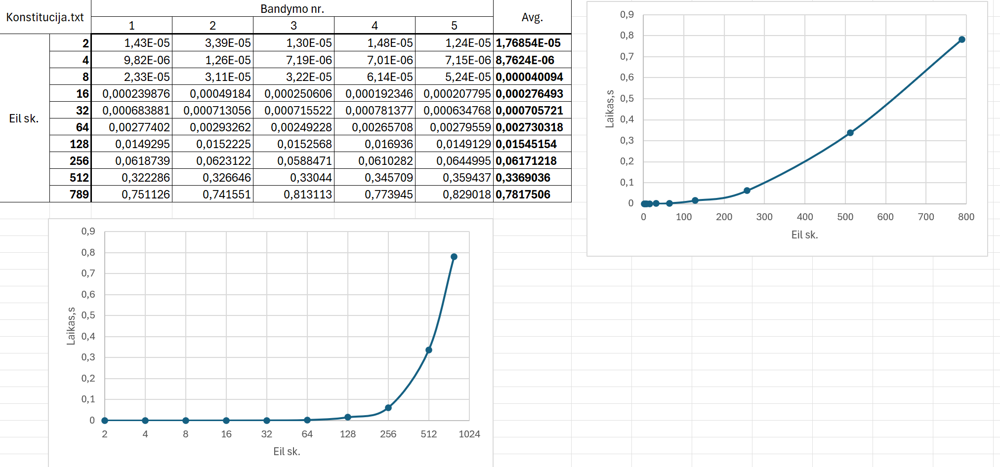

# 0.1
userInput := getInputString()
Iš vartotojo paprašo įvesties konsolėje arba failo pavadimo iš kur imti informaciją, kurią reikia hashuoti.

readInput(&userInputData, userInput)
Gavus string tipo kintamaji, kiekviena raidė paverčiama į binary jos forma ir populiuojamas vector masyvas (userInputData).

arrOfBinData (.size() == 32) := TransformTo256(&userInputData)
Transformuoja vector tipo bitų masyvą į 256 bitus (32 byte'us). Jei vector dydis < 32, kopijuoja ir apverčia pirmus n byte'us, kol dydis = 32.
Jei dydis > 32, tuo pačiu pricipu kopijuoja elementus kol masyvo dydis yra 32 kartotinis. Tuomet rekursyviai apjungia pirmus 2 32 byte'ų blokus, kol masyvo ilgis tampa 32.

magnify(&userInputData) //Kad mažas pokytis reikštų daug (avalanche effect)
Kiekvieną bytę'ą pakelia kvadratu ir kaip naują reikšmę, į jo vietą, įrašo skaičiaus kavadarto liekana, dalinant iš 256 (užtikrinti kad skaičius nebus didesnis negu 8 byte'ai).
Tuomet paskaičiuoja priešingą byte'o vietą masyve ir jam priskiria reikšmę, kuri yra loginės operacijos ~XOR (ne "exlusive" ARBA) rezultatas priešingam ir šiuo metu apdorojamam byte'ui.

joinTwoArr(&arr, &output)
Apjungia du masyvus naudojant bitwise XOR operaciją, ir rezultata išsaugo 'output' kontamąjame

output (vecotr<bitset<8>>) := hashStr(userInputDataStr)
"aePcvgOuOJ1ubrOKwUZZUemayZPeGwtp" - pseudo atsistiktinis 32 byte'ų rinkinys
Iš vartotojo gavus String tipo kintamąjį, panaudojus readInput() gauname 32 byte'ų masyvą.
Tada panaudojant magnify() funckija, vartotojo duomenis pavertus į tinkamo ilgio masyvą su TransformTo256(), "maišome bitus" kaip aprašyta magnify funkcijos apraše.

Tuomet apjungiame vartotojo 32 byte'ų ilgio masyvą su minėtu atsistiktiniu* 32 byte'ų rinkiu su joinTwoArr() funkcija.
Gauname rezultatą, kuris vėl praleidžimas per magnify() funkcija.

-> Hash'as sugeneruotas

## Analizė

1-2 eksperimentas:
Panaudojant testinius failus duomenys direktorijoje, hash'ai yra deterministiniai ir visada yra 256 bit'ų ilgio.

3 eksperimentas:

Vaizduojamas logoritminis (base 2) ir tiesinis grafikas (x ašies reikšmės)

O(2nlog(n)) ?
2n - 2 kart naudojama magnify()
log(n) - TransformTo256()

Taigi ne pats blogiausias variantas, bet ir ne geriausias.

4-5 Eksperimentas: poros.cpp MatchingPairsTest()
make poros
./poros
Generuojamos porų sk ir ilgis pagal aprašytas rekomendacijas.
Paleidus testą 5 kart, sutampančių hash'ų visada - 0

6 Eksperimentas: poros.cpp AvalancheEffectTest()
Bitų lygio Nepanašumas: 
Minimum: 0 bitai
Maximum: 25 bitai
Average: 5.43657 bitai

Hex lygio Nepanašumas: 
Minimum: 0 hex skaitmenys
Maximum: 3 hex skaitmenys
Average: 0.08029 hex skaitmenys

Taigi, pakeitus "mažą" dalį įvesties hash'as nepasikeičia kardinaliai. T.y. Matomi pasikartojantys byte'ai.

7:
Stiprybės - atitinka "bazinius" reikalivimus: ilgis visada 256, funkcija deterministinė, O(2nlog(n)) - ne pats geriausias, bet ir ne blogiausias variantas.

Trūkumai - pakeitus mažą dalį įvesties, išvestis nepasikeičia kardinaliai - neatitinka "avalanche effect" reikalavimui Kaltininkai - TranformTo256, magnify() funkcijos....

