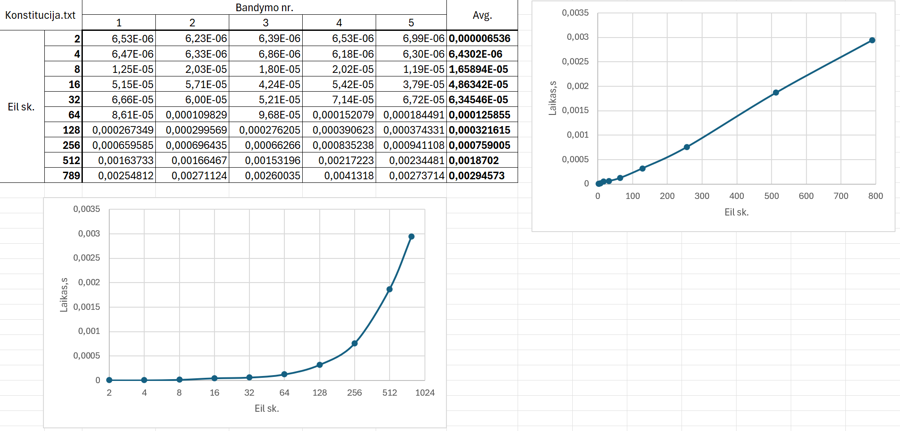

# 0.2
**Skirtumai nuo v0.1 paryškinti.**

userInput := getInputString()\
Iš vartotojo paprašo įvesties konsolėje arba failo pavadimo iš kur imti informaciją, kurią reikia hashuoti.

readInput(&userInputData, userInput, **int &k**)\
Gavus string tipo kintamaji, kiekviena raidė paverčiama į binary jos forma ir populiuojamas vector masyvas (userInputData).
**Kur k - vėliau naudojamas indeksas, kuris išrenka, su kuriuo konstatiniu 256 bit'ų ilgio string'u apjungti naudotojo įvestį**
**k += b.test(0) + b.test(1)*21 + b.test(2)*32 + b.test(3)*43 + b.test(4)*54 + b.test(5)*65 + b.test(6)*76 + b.test(7)*87;**
**k reikšmę nulemia ar bitas 1 ar 0 ir kurioje poziciojoje jis yra.**

**Nauja funkcija**
outputByte := SBoxTransformation(inputByte)\
Atlieka ne tiesinę bitų manipuliacija su bitwise shift'ais, XOR, AND.

arrOfBinData (.size() == 32) := TransformTo256(&userInputData)\
Transformuoja vector tipo bitų masyvą į 256 bitus (32 byte'us). Jei vector dydis < 32, kopijuoja ir apverčia pirmus n byte'us, kol dydis = 32.\
Jei dydis > 32, tuo pačiu pricipu kopijuoja elementus kol masyvo dydis yra 32 kartotinis. Tuomet rekursyviai apjungia/
v0.1 - pirmus 2 32 byte'ų blokus
**v0.2 - pirmą masyvo puse su antrąja,**\
kol masyvo ilgis tampa 32.

**k :=** magnify(&userInputData) //Kad mažas pokytis reikštų daug (avalanche effect)\
Kiekvieną bytę'ą pakelia kvadratu ir kaip naują reikšmę, į jo vietą, įrašo skaičiaus kavadarto **+ byte'o indeksą** liekaną, dalinant iš 256 (užtikrinti kad skaičius nebus didesnis negu 8 byte'ai).\
**Prie k prideda byt'e esačių vienetų keikį (bitset<>.count())**
Tuomet paskaičiuoja priešingą byte'o vietą masyve ir jam priskiria reikšmę, kuri yra loginės operacijos ~XOR (ne "exlusive" ARBA) rezultatas priešingam ir šiuo metu apdorojamam byte'ui. **Gautą reikšmę praleidžia per SBoxTransformation funkcija, kuri ir įrašoma prišingam byte'ui**
**Prie k prideda priešingam byte'e esačių vienetų keikį (bitset<>.count())**

**output :=** joinTwoArr(&arr, &arr2)\
Apjungia du masyvus naudojant bitwise **įvairias operacijas bei prideda pirminį skaičių 31, praleidžia rezultatą per SboxTransformation(), gražina naują apjungtą masyvą.**

output (vecotr<bitset<8>>) := hashStr(userInputDataStr, **salt**)\
**Strs[]** - pseudo atsistiktinis (konstatinis) 32 byte'ų **ilgio string'ų** rinkinys\
Iš vartotojo gavus String tipo kintamąjį, panaudojus readInput() gauname 32 byte'ų masyvą **bei gaunama pradinė k reikšmė**.\
Tada panaudojant magnify() funckija "maišome bitus" kaip aprašyta magnify funkcijos apraše.\
Tuomet vartotojo duomenis paverčiame į tinkamo ilgio masyvą su TransformTo256(),
**k = k * 2 * 3 % Strs_masyvo_ilgis**
**Gauname ideksą kurį atisitinktinį 256 ilgio bit'ų string'ą naudoti. Tai: readInput(Strs[k])**\

**Jei vartotojas pateikė druską -> naudojant joinTwoArr() apjungiame Strs[k] su druska, kuri buvo paversta į 256 bitus naudonajant readInput() bei transformTo256**

Tuomet apjungiame vartotojo 32 byte'ų ilgio masyvą su **konstantiniu (druskuotu jei yra druska)** 32 byte'ų rinkiu su joinTwoArr() funkcija.\
**Ištrinta: *Gauname rezultatą, kuris vėl praleidžimas per magnify() funkcija.***

-> Hash'as sugeneruotas

## Analizė

1-2 eksperimentas:\
Panaudojant testinius failus "duomenys" direktorijoje, hash'ai yra deterministiniai ir visada yra 256 bit'ų ilgio. make main && .main pora kartų su ta pačia įvestimi.

3 eksperimentas v0.2: make konstitucija && ./konstitucija

3 eksperimentas v0.1:

Vaizduojami logoritminiai (base 2) ir tiesiniai grafikas (x ašies reikšmės)

4-5 Eksperimentas: tests.cpp MatchingPairsTest()\
make tests\
./test\
Generuojamos porų sk ir ilgis pagal aprašytas rekomendacijas.\
Paleidus testą 5 kart, sutampančių hash'ų visada - 0

6 Eksperimentas: tests.cpp AvalancheEffectTest(int bandymuKiekis)\
Bitų lygio Nepanašumas: 
Minimum: 1 bitai
Maximum: 165 bitai
Average: 127.117 bitai

Hex lygio Nepanašumas: 
Minimum: 1 hex skaitmenys
Maximum: 64 hex skaitmenys
Average: 59.1298 hex skaitmenys

Vienodų hash'ų kiekis: 0 - kartais pasitaiko kad 1-2 hash'ai yra vienodi -> ir min skirtumas (nepanašumas) = 0

7: Stiprybės - atitinka "bazinius" reikalivimus: ilgis visada 256, funkcija deterministinė, avalanche effect'as dažinausiai geras, on average: ~49% skirtingumas pakeitus tik vieną simbolį. Bijau suklysti - bet sudėtingumas: O(kn) - funkcija yra tiesinė, kur k - kažkoks factor'ius.\
Nežinau kaip tai pratestuoti bet manau kad mano funkcija yra nebloga puzzle-friendliness ir hiding sąvybių atžvilgiu, dėl naudojamų "high-min entropy" konstantų Strs[] masyve.

Trūkumai - Pasitaiko kad pakeitus vieną simbolį hash'ai sutaps

### Papildomi testai
Funkcijų implementacijos paimtos iš - http://www.zedwood.com/article/cpp-sha256-function

Palyginimas su SHA256 algoritmu: compare.cpp\
make compare && ./compare

Pateikiami vidurkiai per 5 bandymus:
| Įvesties ilgis    | sha256 t, s   | ManoHashf(x) t, s | Laikų santykis    |
| ----------------- | ------------- | ----------------- | ----------------- |
| 3                 | 5.7408e-06s   | 1.3546e-06s       | 4.238             |
| 45                | 2.3284e-06s   | 1.7274e-06s       | 1.34792           |
| 128               | 2.8798e-06s   | 3.3062e-06s       | 0.87103           |
| 1000              | 7.0794e-06s   | 2.18598e-05s      | 0.323855          |
| 100000            | 0.00061459s   | 0.00285226s       | 0.215476          |